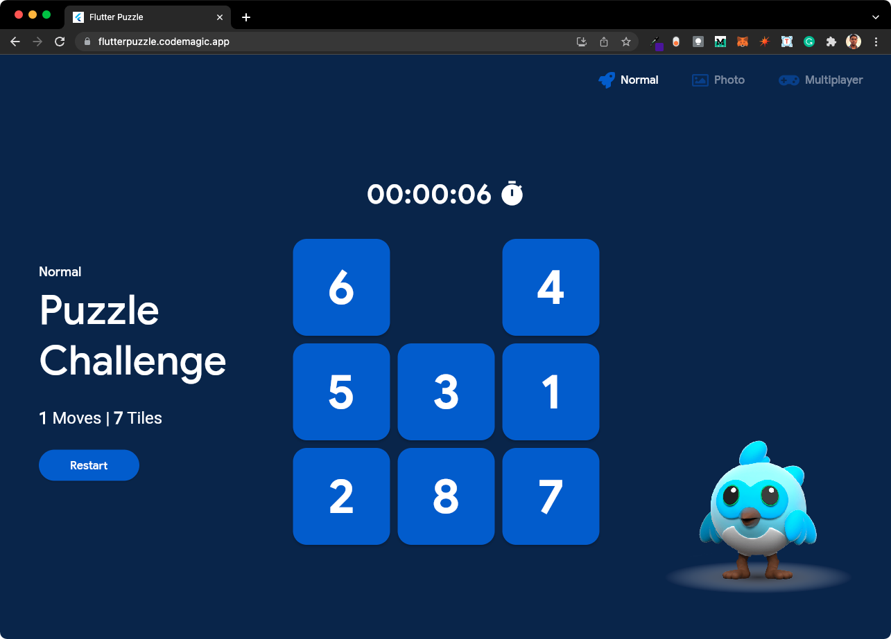
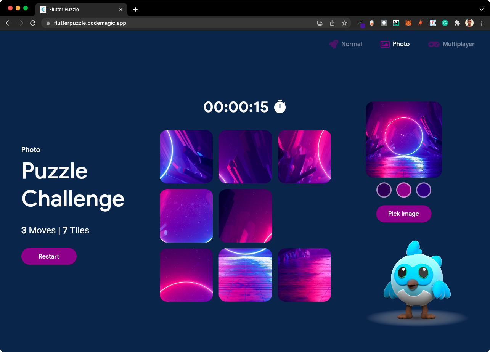
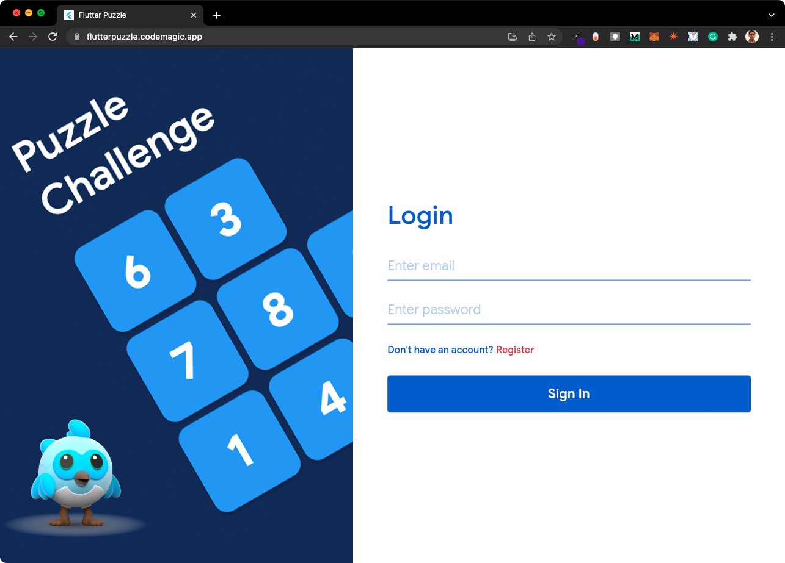
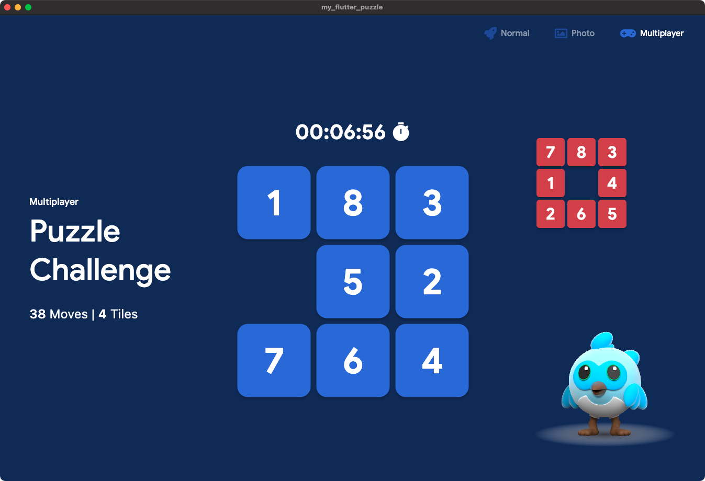

# Flutter Puzzle

> Web App link: https://flutterpuzzle.codemagic.app

Playing a game or solving a puzzle is always fun when you share with friends. We have created a puzzle that consists of three main modes:

* **Normal mode:** The classic slide puzzle configuration.
* **Photo mode:** Ability to generate puzzles from any image uploaded.
* **Multiplayer mode:** Play with others in a competitive head-to-head multiplayer mode.

The puzzle also has an auto solver built-in, it uses the A* algorithm along with some pretty neat tricks to solve the puzzle in the lowest possible moves.

A full explanation of how the A* algorithm works is [here](https://youtu.be/nwtOWpSKGHc).

The puzzle uses **Rive** to display an animated Dash beside the puzzle.

**Riverpod** is used for state management inside the puzzle. The app has pretty challenging state management as there are three modes and the puzzle state is persisted across both the photo mode and the multiplayer mode.

We also used a color palette generator package that can create an entire color palette from just an image, it is used in photo mode to change the theme of the screen according to the image selected.

## Screenshots

**Normal mode:**

**Photo mode:**

**Multiplayer mode:**

## License

Copyright (c) 2022 Soumi Bardhan, Souvik Biswas

Permission is hereby granted, free of charge, to any person obtaining a copy
of this software and associated documentation files (the "Software"), to deal
in the Software without restriction, including without limitation the rights
to use, copy, modify, merge, publish, distribute, sublicense, and/or sell
copies of the Software, and to permit persons to whom the Software is
furnished to do so, subject to the following conditions:

The above copyright notice and this permission notice shall be included in all
copies or substantial portions of the Software.

THE SOFTWARE IS PROVIDED "AS IS", WITHOUT WARRANTY OF ANY KIND, EXPRESS OR
IMPLIED, INCLUDING BUT NOT LIMITED TO THE WARRANTIES OF MERCHANTABILITY,
FITNESS FOR A PARTICULAR PURPOSE AND NONINFRINGEMENT. IN NO EVENT SHALL THE
AUTHORS OR COPYRIGHT HOLDERS BE LIABLE FOR ANY CLAIM, DAMAGES OR OTHER
LIABILITY, WHETHER IN AN ACTION OF CONTRACT, TORT OR OTHERWISE, ARISING FROM,
OUT OF OR IN CONNECTION WITH THE SOFTWARE OR THE USE OR OTHER DEALINGS IN THE
SOFTWARE.